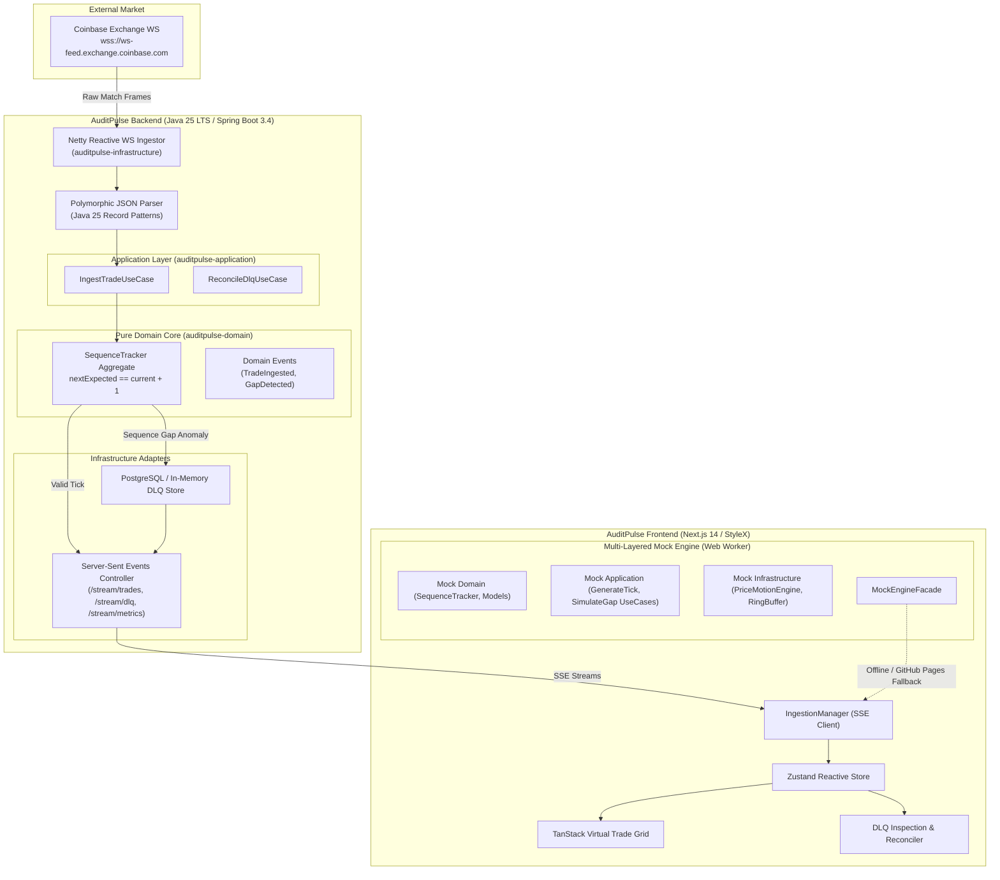
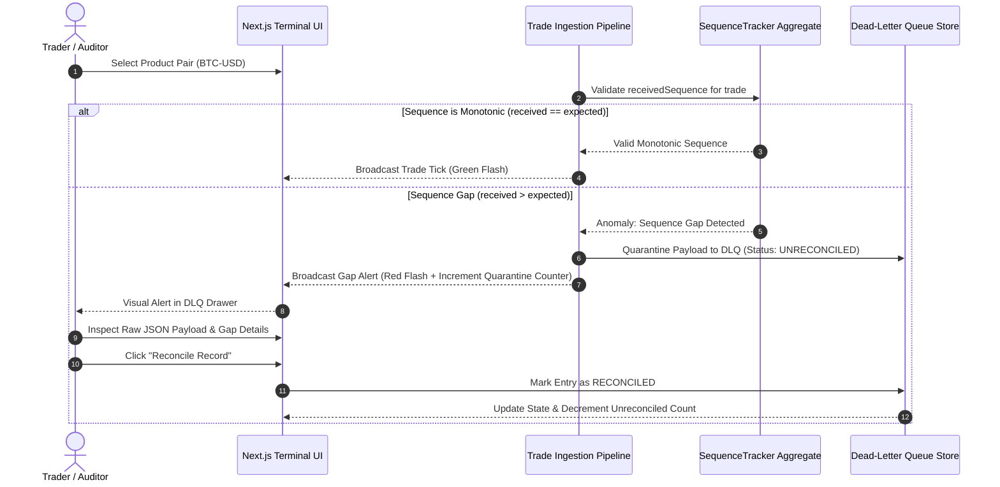

# AuditPulse ⚡

[](https://grzegorzf.github.io/audit-pulse)
[](https://github.com/grzegorzf/audit-pulse/actions)
[](https://github.com/grzegorzf/audit-pulse/actions)
[](LICENSE)

> **High-throughput real-time market trade ingestion engine and Dead-Letter Queue (DLQ) sequence inspector.**

AuditPulse consumes raw execution ticks from Coinbase Exchange WebSocket (`wss://ws-feed.exchange.coinbase.com`), validates trade sequence continuity using Domain-Driven Design (DDD) aggregates, detects sequence gaps and schema anomalies in real time, and streams low-latency updates over Server-Sent Events (SSE) to a cyber-dense Next.js terminal interface styled with Meta StyleX.

🎮 **Try the Live Interactive Demo:** [https://grzegorzf.github.io/audit-pulse](https://grzegorzf.github.io/audit-pulse)  
*(Runs the full multi-layered domain mock engine inside a background Web Worker — zero backend required!)*

---

## 🏛 Architecture Overview

AuditPulse is designed with strict adherence to **Clean Architecture** and **Domain-Driven Design (DDD)** across both the Java backend and the browser-side mock engine.

### System Architecture



---

## 🔄 Dual-Execution Mode

AuditPulse seamlessly operates in two interchangeable environments:

| Feature | Full Backend Mode (`BACKEND_LOCAL`) | Mock Engine Mode (`MOCK_ENGINE`) |
| :--- | :--- | :--- |
| **Primary Target** | Local Dev / Docker (`./start.sh`) | **GitHub Pages** / Browser Sandbox |
| **Data Source** | Live Coinbase WS (`BTC-USD`, `ETH-USD`) | Geometric Brownian Motion (`PriceMotionEngine`) |
| **Throughput** | 100 – 1,000+ trades/sec | 120 – 500+ trades/sec (configurable) |
| **Sequence Validation** | Java 25 `SequenceTracker` Aggregate | TypeScript `MockSequenceTracker` Aggregate |
| **Anomaly Quarantine** | PostgreSQL & In-Memory Circular Buffer | Bounded `InMemoryMockDlqRepository` |
| **Fault Injection** | REST `POST /api/v1/simulate/gap` | Web Worker `TRIGGER_GAP` / Schema Violations |
| **Zero Backend Needed** | ❌ (Requires Docker / Java) | ✅ **100% Client-Side Static Export** |

### Sequence Validation & DLQ Lifecycle



---

## 📦 Project Structure

```text
audit-pulse/
├── .github/workflows/
│   ├── backend-ci.yml                 # Java 25 Maven build & multi-module test runner
│   └── frontend-deploy.yml            # Next.js static export & automated GitHub Pages deploy
├── .npmrc                             # pnpm release age policy (minimum-release-age=2880)
├── docker-compose.yml                 # 1-click orchestration (PostgreSQL + Backend + Frontend)
├── start.sh                           # Clean launch script (purges orphan state & builds)
├── delete.sh                          # Tear-down script (cleans containers, volumes & caches)
├── LICENSE                            # MIT License (2026 Grzegorz Forysiak)
├── CONTRIBUTING.md                    # Contribution & testing guidelines
│
├── auditpulse-backend/                # Clean Architecture Multi-Module Java 25 Engine
│   ├── pom.xml                        # Root aggregator POM
│   ├── auditpulse-domain/             # Pure Java 25: 0 framework dependencies
│   │   ├── model/                     # ProductPair, TradeMatch, DeadLetter, SequenceTracker Aggregate
│   │   ├── event/                     # Sealed DomainEvent hierarchy (TradeIngested, SequenceGap, Duplicate)
│   │   └── port/                      # Inbound & Outbound Ports (Publisher, DlqRepo, Metrics)
│   ├── auditpulse-application/        # Application Use Cases
│   │   ├── usecase/                   # IngestTradeUseCase, QueryDlqUseCase, ReconcileDlqUseCase
│   │   └── dto/                       # IngestionCommand, MetricsSnapshot
│   ├── auditpulse-infrastructure/     # Netty WS, SSE Controllers, Record Pattern Parser
│   └── auditpulse-boot/               # Spring Boot 3.4 Application & Bean Wiring (Virtual Threads)
│
└── auditpulse-frontend/               # Next.js 14, StyleX, TanStack Virtual UI
    ├── package.json                   # Scripts, dependencies
    ├── next.config.mjs                # Static export (output: 'export') with basePath support
    ├── tsconfig.json                  # Strict TypeScript configuration
    ├── src/
    │   ├── app/                       # Next.js App Router root & cyber-dense dashboard
    │   ├── components/                # Virtual list table, DLQ drawer, Metrics sparkline
    │   ├── styles/tokens.stylex.ts    # Meta StyleX cyberpunk design tokens
    │   ├── lib/                       # SSE client manager, Zustand state store, TypeScript types
    │   ├── worker/                    # Web Worker entrypoint
    │   └── mock-engine/               # Multi-Layered Browser DDD Engine
    │       ├── core/domain/           # MockTradeMatch, MockDeadLetter, MockSequenceTracker
    │       ├── application/           # GenerateTradeTick, SimulateSequenceGap, ReconcileDlq
    │       ├── infrastructure/        # PriceMotionEngine, SlidingWindowMetrics, InMemoryRepo
    │       └── interface/             # MockEngineFacade
```

---

## ⚡ Quick Start

### Centralized Port Configuration (`.env`)
AuditPulse uses dedicated, collision-resistant unique ports defined centrally in `.env`:
* **Frontend UI (Next.js + StyleX):** `${AUDITPULSE_FRONTEND_PORT:-3840}` → [http://localhost:3840](http://localhost:3840)
* **Backend API & SSE (Spring Boot):** `${AUDITPULSE_BACKEND_PORT:-8840}` → [http://localhost:8840](http://localhost:8840)
* **PostgreSQL 16 Database:** `${AUDITPULSE_POSTGRES_PORT:-5842}` → `localhost:5842`

---

### Option 1: 1-Click Launch with Docker (Recommended)

To start with a clean state:
```bash
./start.sh
```
*UI will be live at [http://localhost:3840](http://localhost:3840)*.

To completely tear down all containers, images, volumes, and caches:
```bash
./delete.sh
```

---

### Option 2: Local Development

#### 1. Backend (Java 25 LTS)
```bash
cd auditpulse-backend
mvn clean test
mvn spring-boot:run -pl auditpulse-boot
```
*API endpoints:*
- `GET /api/v1/stream/trades?product=BTC-USD` — SSE Real-time Trade Stream
- `GET /api/v1/stream/dlq` — SSE Anomaly & Gap Stream
- `GET /api/v1/stream/metrics` — SSE Telemetry Stream (1000ms cadence)
- `GET /api/v1/dlq` — REST Filtered Quarantined Entries
- `POST /api/v1/dlq/{id}/reconcile` — REST Reconciliation Endpoint
- `POST /api/v1/simulate/gap?product=BTC-USD` — REST Fault Injection Trigger

#### 2. Frontend (Next.js + StyleX)
```bash
cd auditpulse-frontend
pnpm install --frozen-lockfile
pnpm test          # Runs mock engine unit tests
pnpm dev           # Starts Next.js dev server on :3840
```
Open [http://localhost:3840](http://localhost:3840).

#### 3. Static Production Build for GitHub Pages
```bash
cd auditpulse-frontend
GITHUB_PAGES=true pnpm build
```
Generates fully optimized static HTML/CSS/JS in `auditpulse-frontend/out/` configured with base path `/audit-pulse`.

---

## 🧪 Testing & Verification

### Run All Suites (1-Click)
```bash
./test.sh
```
Executes all 20 Java 25 backend tests across 5 Maven modules and all 12 TypeScript frontend / Mock Engine tests.

### Backend Verification (Java 25 LTS)
```bash
cd auditpulse-backend
mvn clean test
```
- **Domain Invariant Tests:** `SequenceTrackerTest` validates strict monotonic invariant enforcement.
- **Clean Architecture Rules:** Architecture boundary verification ensuring zero framework leakage into domain core.
- **Use Case Orchestration:** `IngestTradeUseCaseTest`, `QueryDlqUseCaseTest`, `ReconcileDlqUseCaseTest`.
- **Coinbase Message Parsing:** Pattern matching record tests against real Coinbase execution frames.
- **Sliding-Window RingBuffer:** `RingBufferMetricsAggregatorTest` telemetry rate calculation.

### Frontend & Mock Engine Verification
```bash
cd auditpulse-frontend
pnpm test
pnpm tsc --noEmit
```
- **`MockSequenceTracker` Tests:** Monotonic progression, gap detection, duplicate sequence filtering.
- **`PriceMotionEngine` Tests:** Geometric Brownian motion simulation for `BTC-USD` and `ETH-USD`.
- **`InMemoryMockDlqRepository` Tests:** Storage limits, chronological ordering, pagination, reconciliation.
- **`MockEngineFacade` Tests:** Complete end-to-end integration and message dispatch.
- **`StreamStore` Tests:** Zustand reactive state, trade buffering (capped at 15k), feed target transitions.

---

## 🛡 License

This project is licensed under the MIT License - see the [LICENSE](LICENSE) file for details.

Copyright (c) 2026 Grzegorz Forysiak.
